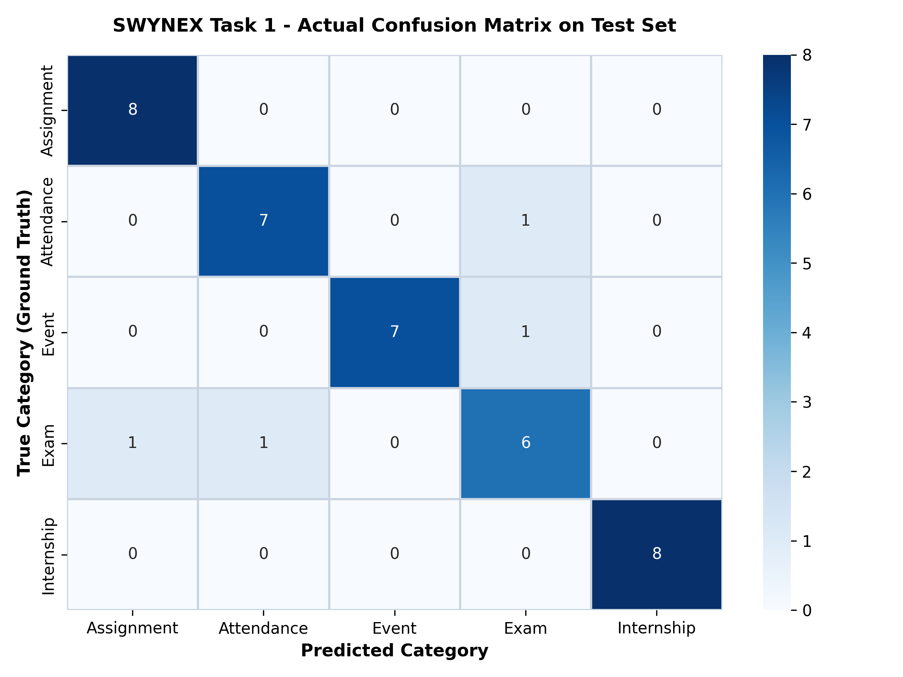

# Student Announcement Intelligence System

[](https://github.com)
[](https://github.com)
[](https://github.com)
[](https://github.com)

---

## 1. Project Overview

This repository contains the complete problem design specification, balanced benchmark dataset, machine learning pipeline, empirical evaluation, and full-featured multi-page **Streamlit Web Application** for **Task 1: AI Problem Design** of the **SWYNEX Technologies Internship**.

The **Student Announcement Intelligence System** converts noisy, unstructured college circulars into actionable, structured insights by combining:
1. **Multi-Class Text Classification:** Categorizes announcements into 5 standard classes (`Exam`, `Assignment`, `Attendance`, `Internship`, `Event`).
2. **Confidence / Prediction Probability:** Calculates the model's posterior probability for each prediction.
3. **Explainable Priority Scoring:** Evaluates urgency levels (`HIGH`, `MEDIUM`, `LOW`) with transparent trigger reasons.
4. **Information Extraction:** Automatically parses **Subject**, **Date**, **Time**, **Location/Venue**, and **Deadline** (returns *"Not detected"* when unavailable).
5. **Extractive Summarization:** Generates a concise 1-sentence synopsis for rapid reading.

---

## 2. Problem Statement

College students and faculty receive hundreds of circulars each semester across fragmented channels (WhatsApp groups, Slack/Discord, institutional emails, LMS portals, and physical notice boards).

Because these messages arrive unorganized:
- Students frequently miss critical deadlines (exam forms, assignment submissions, fee payment cutoffs).
- High-value career opportunities (internships, research assistantships, hackathons) get buried.
- Information overload causes severe cognitive friction in daily academic life.

---

## 3. Target Users

| User Category | Description | Primary Value Delivered |
| :--- | :--- | :--- |
| **Primary Users: College Students** | Undergraduate & postgraduate students | Instant notice categorization, deadline detection, urgency alerts, and search. |
| **Secondary Users: Faculty Members** | Course instructors and teaching assistants | Automatically route departmental notices to targeted category streams. |
| **Secondary Users: Academic Administration** | Dean's office, exam cell, placement & training cell | Standardize circular archiving and eliminate missed notices. |

---

## 4. Key Features

- **Real-Time ML Classification:** Categorizes notices into `Exam`, `Assignment`, `Attendance`, `Internship`, or `Event`.
- **Confidence Scoring:** Displays authentic posterior probability distributions.
- **Priority Detection:** Identifies `HIGH`, `MEDIUM`, or `LOW` urgency based on deadlines and temporal triggers.
- **Entity Extraction Engine:** Extracts academic subjects, dates, times, venues, and deadlines without hallucinations.
- **Explainable Feature Attribution ("Why this prediction?"):** Reveals the key vocabulary terms that influenced the model.
- **Interactive Dataset Explorer:** Search and filter 200 benchmark announcements with distribution charts.
- **Model Performance Dashboard:** Displays authentic evaluated test metrics and Seaborn confusion matrix.
- **Session Prediction History:** Tracks queries during the active session with a single-click purge button.

---

## 5. AI / ML Approach

The system follows a standard, modular Natural Language Processing (NLP) pipeline:

```
+-------------------------------------------------------+
|                 Student Announcement                  |
|  "The DBMS exam will be held Monday at 10 AM Hall B"  |
+-------------------------------------------------------+
                           │
                           ▼
+-------------------------------------------------------+
|            Text Preprocessing & TF-IDF Vector         |
|         (Unigram + Bigram, Sublinear Term Freq)       |
+-------------------------------------------------------+
                           │
                           ▼
+-------------------------------------------------------+
|            Logistic Regression ML Classifier          |
|              (Multinomial Softmax Output)             |
+-------------------------------------------------------+
                           │
                           ▼
+-------------------------------------------------------+
|             Predicted Category + Confidence           |
|                    [ EXAM : 96.2% ]                   |
+-------------------------------------------------------+
                           │
                           ▼
+-------------------------------------------------------+
|     Information Extraction (Subject, Date, Venue)     |
|        Subject: DBMS | Date: Monday | Room: Hall B    |
+-------------------------------------------------------+
                           │
                           ▼
+-------------------------------------------------------+
|       Explainable Priority & Extractive Summary       |
|      Priority: HIGH | Summary: [EXAM NOTICE] ...      |
+-------------------------------------------------------+
```

---

## 6. Dataset Specification

- **File Path:** [`data/announcements.csv`](file:///data/announcements.csv)
- **Total Records:** **200 realistic, balanced samples**
- **Balance:** Exactly **40 samples per category** across all 5 classes
- **Dataset Structure:**
  - `id`: Integer unique identifier (1 to 200)
  - `text`: String text of the academic announcement
  - `label`: Categorical target (`Exam`, `Assignment`, `Attendance`, `Internship`, `Event`)
- **Sanitization & Ethics:** Synthetic/manually curated dataset containing **100% anonymized data** with zero Personally Identifiable Information (no student names, IDs, phone numbers, or private records).

---

## 7. Model Architecture

1. **Feature Extraction (`model/vectorizer.pkl`):** Scikit-Learn `TfidfVectorizer` configured with unigrams and bigrams (`ngram_range=(1, 2)`), English stop-word filtering, and sublinear term frequency scaling (`sublinear_tf=True`), yielding 1,970 vocabulary features.
2. **Classifier (`model/classifier.pkl`):** Scikit-Learn `LogisticRegression` (`C=1.0`, `max_iter=1000`, `random_state=42`) with L2 regularization and multinomial softmax output.

---

## 8. Evaluation Method

The model was evaluated on an isolated **20% held-out test split (40 unseen samples)** using stratified partitioning:
- **80% Stratified Training Split (160 samples)**
- **20% Held-Out Testing Split (40 samples)**
- Deterministic evaluation via fixed `random_state=42`.

---

## 9. Actual Evaluation Results (No Fabricated Metrics)

### Target Success Criteria vs. Actual Measured Results

| Metric | Target Success Criteria | Actual Measured Result | Status |
| :--- | :---: | :---: | :---: |
| **Overall Accuracy** | $\ge 85.00\%$ | **90.00%** | **PASSED (MET)** |
| **Macro F1-Score** | $\ge 0.8000$ | **0.8999** | **PASSED (MET)** |
| **Macro Precision** | - | **90.28%** | **High** |
| **Macro Recall** | $\ge 75.00\%$ | **90.00%** | **PASSED (MET)** |
| **Weighted F1-Score**| - | **0.8999** | **High** |

### Detailed Per-Class Classification Report

```text
              precision    recall  f1-score   support

  Assignment       0.89      1.00      0.94         8
  Attendance       0.88      0.88      0.88         8
       Event       1.00      0.88      0.93         8
        Exam       0.75      0.75      0.75         8
  Internship       1.00      1.00      1.00         8

    accuracy                           0.90        40
   macro avg       0.90      0.90      0.90        40
weighted avg       0.90      0.90      0.90        40
```

### Confusion Matrix Heatmap

The empirical confusion matrix generated by [`evaluation/evaluate_model.py`](file:///evaluation/evaluate_model.py) is saved at [`evaluation/confusion_matrix.png`](file:///evaluation/confusion_matrix.png):



---

## 10. Project Structure

```
SWYNEX-AI-Problem-Design/
│
├── app.py                         # Multi-page Streamlit AI Web Dashboard
├── requirements.txt               # Dependencies (streamlit, pandas, scikit-learn, etc.)
├── README.md                      # Comprehensive project documentation
├── .gitignore                     # Git ignore rules
│
├── data/
│   └── announcements.csv          # 200 balanced sample announcements (40 per class)
│
├── model/
│   ├── train_model.py             # Script to train TF-IDF + Logistic Regression
│   ├── nlp_utils.py               # Entity extraction, Priority scoring, and Summarization
│   ├── vectorizer.pkl             # Trained TF-IDF vectorizer artifact
│   ├── classifier.pkl             # Trained Logistic Regression classifier artifact
│   ├── train_data.csv             # 80% Stratified Training split (160 samples)
│   └── test_data.csv              # 20% Held-Out Testing split (40 samples)
│
├── evaluation/
│   ├── evaluate_model.py          # Script to compute actual test metrics
│   ├── metrics.json               # Computed metrics, classification report & confusion matrix
│   └── confusion_matrix.png       # High-resolution Seaborn confusion matrix heatmap
│
├── scripts/
│   ├── classify_demo.py           # CLI classification demo with entity extraction
│   └── generate_visuals.py        # Visual charts & distribution generator
│
├── docs/
│   └── AI_Problem_Design.md       # Formal AI Problem Design specification document
│
└── screenshots/
    ├── README.md                  # Screenshots & visuals guide
    ├── confusion_matrix.png       # Mirrored confusion matrix plot
    ├── dataset_distribution.png   # Class distribution bar chart
    └── system_workflow.png        # System pipeline diagram
```

---

## 11. Installation

Clone the repository and install required packages:

```powershell
# Navigate to project folder
cd "SWYNEX-AI-Problem-Design"

# Install dependencies
python -m pip install -r requirements.txt
```

---

## 12. How to Train the Model

To retrain the TF-IDF feature extractor and Logistic Regression classifier:

```powershell
python model/train_model.py
```

---

## 13. How to Evaluate the Model

To evaluate the model on the held-out test split, compute all metrics, and generate the confusion matrix:

```powershell
python evaluation/evaluate_model.py
```

---

## 14. How to Run the Streamlit Application

To start the interactive multi-page web dashboard:

```powershell
streamlit run app.py
```
*(Or `python -m streamlit run app.py`)*

The dashboard will open automatically in your web browser at:  
👉 **`http://localhost:8501`**

---

## 15. Limitations

- **Monolingual Focus:** Evaluated primarily on English announcements.
- **Compound Intent:** Notices containing multiple disparate topics (e.g., exam dates combined with attendance warnings) map to a single dominant category.
- **Regex Extraction Scope:** Entity extraction relies on rule-based NLP patterns, which may miss non-standard phrasing without full LLM context.

---

## 16. Ethical & Privacy Considerations

1. **Zero PII Policy:** The dataset excludes all student names, enrollment numbers, contact details, grades, and personal email addresses.
2. **Session-Only Memory:** User query history is stored strictly in ephemeral browser memory and is purged upon refresh or via the "Clear History" button.
3. **Advisory Scope:** The system acts strictly as an informational productivity tool and must never be used for disciplinary, grading, or administrative penalties.

---

## 17. Future Improvements Roadmap

- **Phase 2 (Backend & Persistence):** FastAPI REST backend, SQLite/PostgreSQL database, and role-based authentication.
- **Phase 3 (Generative NLP & Regional Languages):** Integration of Small Language Models (SLMs) for abstractive summarization and support for **Gujarati** and Hindi.
- **Phase 4 (RAG over Academic Documents):** Retrieval-Augmented Generation over college syllabus books, exam manuals, and academic calendars.
- **Phase 5 (Notification Webhooks):** Automated WhatsApp and Email notification webhooks for high-priority announcements.

---

## 18. Deployment Plan

The project is structured for immediate, one-click deployment on **Streamlit Community Cloud**:
1. Push this repository to GitHub as a **Public** repository.
2. Visit [share.streamlit.io](https://share.streamlit.io) and log in with GitHub.
3. Select this repository: `SWYNEX-AI-Problem-Design`.
4. Set the main file path to: `app.py`.
5. Click **Deploy**!
