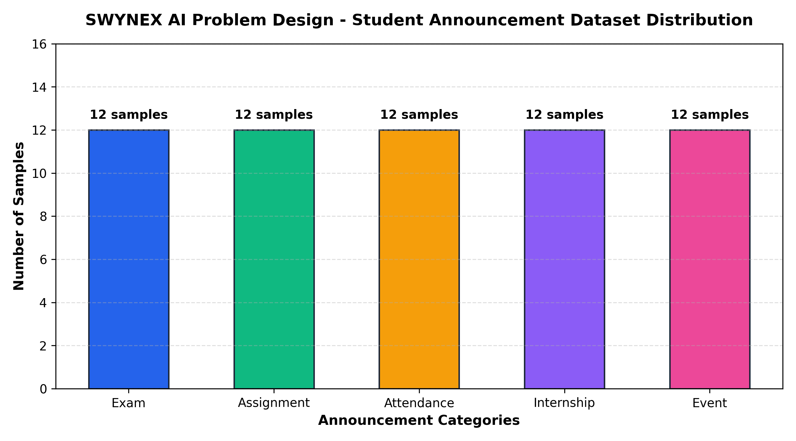
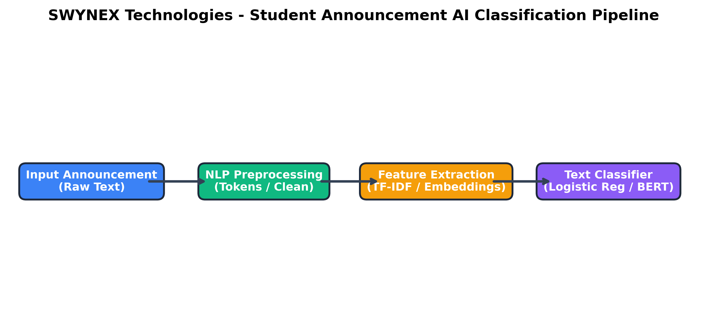

# Project Screenshots and Visual Assets

This directory stores architectural diagrams, data distribution visualizations, and workflow assets for the **SWYNEX-AI-Problem-Design** project.

---

## 1. Intended System Pipeline & Output Flow

```
+-------------------------------------------------------+
|                 Student Announcement                  |
|     "The DBMS examination will be held on Monday"     |
+-------------------------------------------------------+
                           │
                           ▼
+-------------------------------------------------------+
|                  Text Classification                  |
|            (NLP Preprocessing & Inference)            |
+-------------------------------------------------------+
                           │
                           ▼
+-------------------------------------------------------+
|                  Predicted Category                   |
+-------------------------------------------------------+
                           │
       ┌───────────┬───────┴───────┬────────────┐
       ▼           ▼               ▼            ▼
   [ Exam ]  [ Assignment ]  [ Attendance ]  [ Internship ]  [ Event ]
```

---

## 2. Generated Visual Assets

### A. Dataset Category Distribution


### B. AI Classification Pipeline


---

## How to Re-generate Visuals

Run the Python visualization generator script from the project root:

```powershell
python scripts/generate_visuals.py
```

> **Note:** *In accordance with Task 1 requirements, this repository focuses on AI problem design, specification, and data analysis. No fabricated or simulated model performance results are included.*
